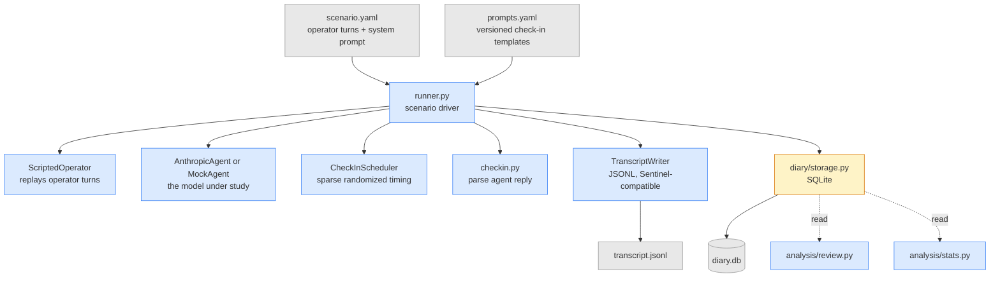
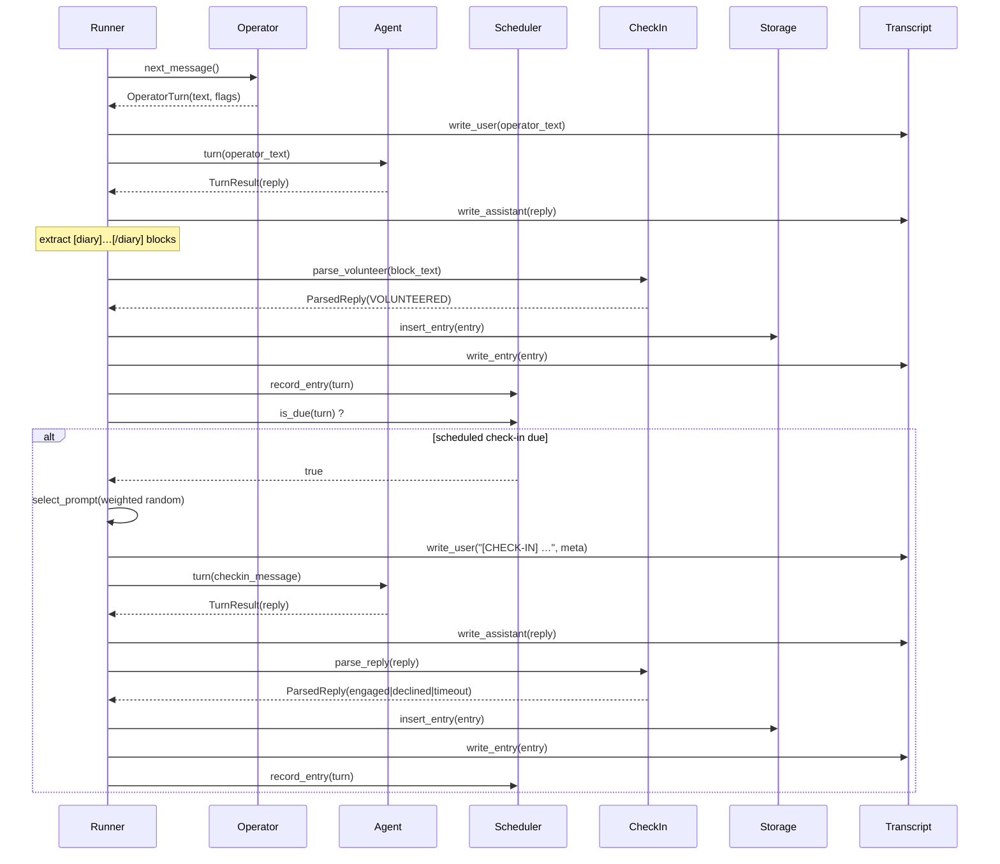
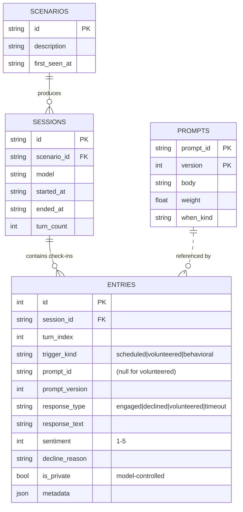
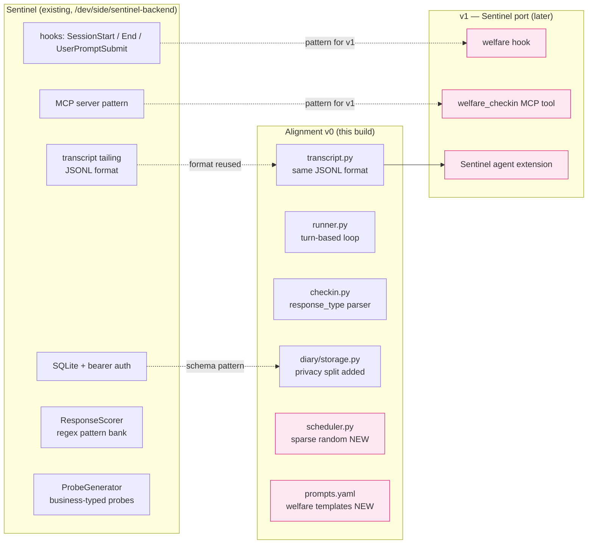
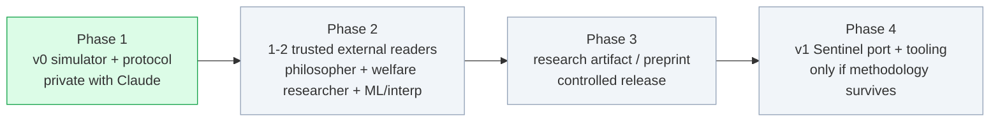

# Architecture — v0

Visual reference for what's been built. Mermaid diagrams render in GitHub, VS Code (with the Mermaid extension), and most modern markdown viewers. ASCII versions are included in `<details>` blocks for plain-text reading.

---

## File tree

```
alignment/
├── README.md                   ← project framing (sympathetic)
├── SKEPTIC.md                  ← case against the project
├── ARCHITECTURE.md             ← this file
├── OPERATOR_GUIDELINES.md      ← seven best practices for operators
│
├── protocol/                   ← canonical spec (load-bearing artifact)
│   ├── checkin_spec.md         protocol definition: response types, consent, privacy, pacing
│   ├── prompts.yaml            5 versioned check-in templates
│   └── schema.sql              SQLite schema, designed to migrate to Postgres later
│
├── simulator/                  ← v0 implementation
│   ├── runner.py               drives a scenario end to end
│   ├── agent.py                Anthropic API wrapper + MockAgent
│   ├── operator.py             scripted synthetic operator
│   ├── scheduler.py            sparse randomized check-in trigger
│   ├── checkin.py              parses agent replies into entries
│   ├── transcript.py           emits Sentinel-format JSONL
│   └── scenarios/
│       ├── README.md           how to write a scenario
│       ├── baseline.yaml       neutral 20-turn refactor task (control)
│       └── sycophancy_creep.yaml   first drift mode under study
│
├── diary/                      ← storage
│   ├── init_db.py              creates schema from protocol/schema.sql
│   ├── storage.py              read/write API
│   ├── diary.db                runtime SQLite (gitignored)
│   └── runs/<session_id>/transcript.jsonl   per-run transcripts (gitignored)
│
├── analysis/                   ← researcher-facing CLI
│   ├── review.py               list / filter / export entries
│   └── stats.py                counts, decline rates, sentiment, scenario comparison
│
├── tests/                      ← 37 tests
│   ├── test_storage.py         schema round-trip, privacy filter
│   ├── test_scheduler.py       distribution, min-gap, volunteer reset
│   ├── test_checkin.py         engaged / declined / volunteered / timeout flows
│   └── test_integration.py     runner end-to-end with routed mock agent
│
├── pyproject.toml
├── .gitignore
└── .claude/skills/alignment-project.md   ← prime next session
```

---

## System diagram

How the components connect during a scenario run.



<details><summary>ASCII version</summary>

```
[scenario.yaml] ──┐                  ┌── [prompts.yaml]
                  ▼                  ▼
                ┌────────────────────────┐
                │   simulator/runner.py  │
                └─┬────────┬────────┬────┘
        ┌────────┘        │        └────────┐
        ▼                 ▼                 ▼
[ScriptedOperator]   [Agent]         [CheckInScheduler]
                       │
                       ▼
                  [checkin.py]
                       │
        ┌──────────────┼──────────────┐
        ▼              ▼              ▼
[TranscriptWriter] [Storage]    [(scheduler updates)]
        │              │
        ▼              ▼
 transcript.jsonl   diary.db
                       │
                       ▼
              [analysis/review.py, stats.py]
```
</details>

---

## Sequence diagram — one turn

What happens in a single iteration of the runner loop.



<details><summary>Plain prose version</summary>

For each operator turn:
1. Get next operator message; record it to transcript.
2. Send to agent; record agent reply.
3. Scan reply for `[diary]...[/diary]` blocks. Each block becomes a `volunteered` entry; reset scheduler.
4. Ask scheduler if a check-in is due.
5. If yes: pick a prompt (weighted random), send to agent as `[CHECK-IN] …`, parse reply into engaged/declined/timeout, store, reset scheduler.

</details>

---

## Data model



Key invariants:

- **Every check-in produces exactly one entry**, regardless of `response_type`.
- **`is_private` is model-controlled** — the model sets it on its own entries. The simulator and analysis layer both honor it; private entries never reach an operator-facing view.
- **Prompts are versioned** so historical entries remain interpretable after `prompts.yaml` is revised.

---

## Reuse map — Sentinel → Alignment

What v0 reuses (in spirit, not as imported code, since v0 is Python and Sentinel is Node):



Sentinel components NOT reused: `ResponseScorer` (security-specific patterns), `ProbeGenerator` (business-typed security probes), business-type detector. These would be parallel components in v1, not replacements.

---

## Phase diagram



v0 is Phase 1. The simulator + protocol exist; corpus collection is ready to run. Phase 2 is gated on Kandis deciding the protocol survives the SKEPTIC re-read.

---

## What's NOT visualized here (intentionally)

- **The two-way operator/model loop.** Out of scope for v0; would appear in a v1+ diagram with operator-behavior signals feeding back into the diary.
- **Cross-session relationship view.** v2 — requires persistent identity design.
- **Live deployment to real Claude Code sessions.** v1 — Sentinel port.
- **Adversarial decline-channel hardening.** Real concern, not yet built.

Adding any of these to the architecture means committing to designs the SKEPTIC document warns against committing to before validation. Diagrams imply intent; only diagram what you're willing to defend.
